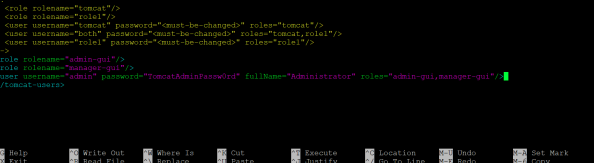
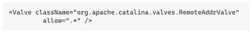
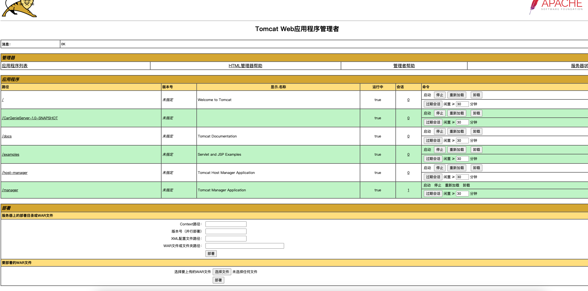

# Car Genie Server - 后端部署指南

## 1. 刷新 Maven

确保 IntelliJ 识别 Maven 项目，并正确加载依赖：

1.  右键 `pom.xml` → 选择 `Maven` → `Reload Project`
2.  或者，在 `Maven` 侧边栏点击 **刷新按钮**（循环箭头图标）
3.  等待 Maven 重新下载依赖，确保 `javax.servlet-api` 等依赖加载成功

## 2. 配置 Tomcat 服务器

### 步骤 1：添加 Tomcat 服务器

1.  打开 `Run > Edit Configurations`
2.  点击 `+` 按钮，选择 `Tomcat Server > Local`
3.  如果未安装 Tomcat，IDE 可能会提示选择 Tomcat 安装路径

### 步骤 2：在 Tomcat 配置中添加 Web 部署

1.  返回 `Run > Edit Configurations`
2.  选择 `Tomcat Server > Local`
3.  切换到 `Deployment` 选项卡
4.  点击 `+`，选择 `Artifact`
5.  选择 `CarGenieServer:war exploded`
6.  将 `Application Context` 设为 `/`（即 `http://localhost:8080/`）

### 步骤 3：添加 Web 部署（Artifact）（应该可以跳过）

**应该可以直接跳过**，步骤2窗口下方会出现 `Artifact不存在` 的警告，点一下`Fix`就会自动创建。目前假设前端存放在另一个 repo，这里仅配置后端部署，确保 `war exploded` 形式的 `Artifact` 存在。

1.  打开 `File > Project Structure (Ctrl + Alt + Shift + S)`
2.  导航到 `Artifacts` 选项卡
3.  点击 `+` 按钮，选择 `Web Application: Exploded`
4.  选择 `CarGenieServer` 作为 `Module`
5.  点击 `Apply` 和 `OK`

### 步骤 4：配置 Tomcat 端口（建议跳过，用默认值就行）

1.  在 `Server` 选项卡中：
    -   默认端口为 `8080`，如有冲突可更改（如 `8081`）
    -   `On 'Update' action` 设为 `Restart server`
    -   `On frame deactivation` 设为 `Do nothing`

### 步骤 5：启动 Tomcat

1.  `Build` → `Rebuild project`
2.  `Build` → `Build Artifacts` → `Rebuild`
3.  点击 **Run** 启动 Tomcat
4.  浏览器会自动打开 / 也可以手动在浏览器访问 `http://localhost:8080/` 或 `http://localhost:8080/CarGenieServer-1.0-SNAPSHOT/`(请根据target文件里的war包名自行调整)
5.  如果连接成功，会出现一条`CarGenie Server is running successfully`的信息。

### 步骤 6：如何设置tomcat manager来方便部署target里的war包
1. 打开`conf/tomcat-users.xml`文件，此文件位于安装的tomcat的位置。添加如下内容：
用terminal打开tomcat的conf文件夹，然后在最后输入`nano tomcat-users.xml`，然后在最后添加如下内容：
```xml
<role rolename="admin-gui"/>
<role rolename="manager-gui"/>
<user username="admin" password="password" fullName="Administrator"
roles="admin-gui,manager-gui"/>
```
如图所示：Click CTRL + X to exit and save it.


2. 打开`webapps/manager/META-INF/context.xml`文件，此文件位于安装的tomcat的位置。添加如下内容：
用terminal进入META-INF文件，然后在最后输入`nano tomcat-users.xml`，然后修改如下内容来允许所有ip访问：


3. 访问`http://localhost:8080/manager/html`，输入用户名和密码，然后点击`Choose File`选择war包，然后点击`Deploy`即可部署war包。


**每次修改代码后，只需要重新build + build artifact 一下，然后重新部署war包即可。**
