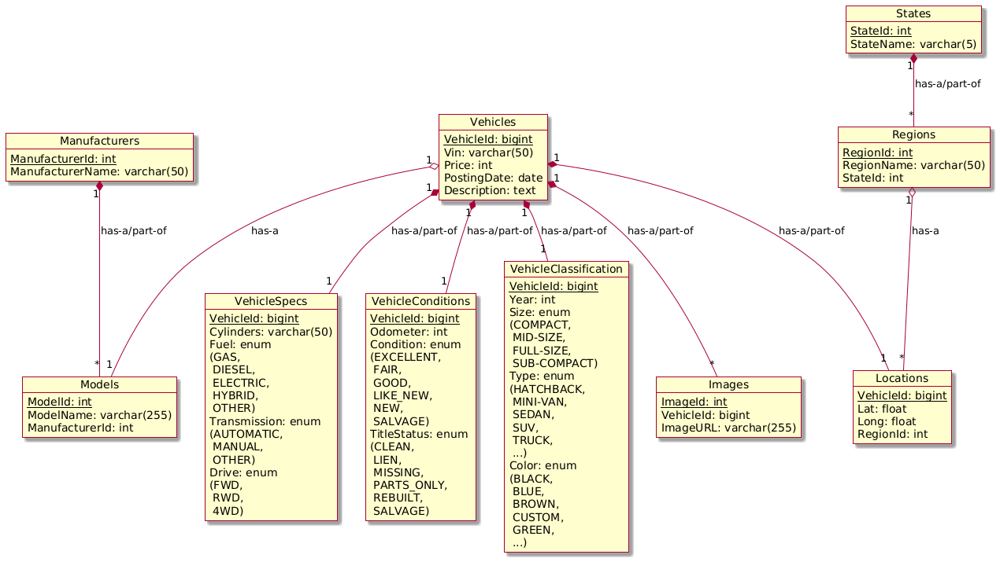

# PM2

## Project and Team

Project Name: **CarGenie**

Team Name: **HuskyAutoCoders** (Team 4)

Team Members:
- Yun Chen Chang
- Jinpeng Liu
- Luwei Fang
- Qiuying Zhuo
- Wen Xie
- Zhe Zhang
- Ziqi Liu

Reference to PM1: [PM1](https://docs.google.com/document/d/1gjREEfOMyCWx_K2DIqv8zDLRQRgHMfI71NrNcuou1_Y/edit?tab=t.0)

Dataset used: [Kaggle Used Cars Dataset](https://www.kaggle.com/datasets/austinreese/craigslist-carstrucks-data)

## UML



-  **Manufacturers** – Table storing vehicle manufacturer data
-  **Models** – Table containing vehicle model information
-  **Vehicles** – Core table containing vehicle details
-  **VehicleSpecs** – Table for detailed vehicle specifications (engine type, drivetrain, etc.)
-  **VehicleConditions** – Table tracking vehicle conditions (new, used, accident history, etc.)
-  **VehicleClassification** – Table categorizing vehicles (sedan, SUV, truck, etc.)
-  **Images** – Table storing URLs of vehicle images
-  **Locations** – Table for vehicle geographic data (state, latitude, longitude)
-  **Regions** – Table representing geographic regions
-  **States** – Table of U.S. states information


## Row Counts


Total row count across all tables is above the 100K requirement.

## Create Table Statements

```sql
-- Make sure the database exists
CREATE SCHEMA IF NOT EXISTS CarGenieDB;
USE CarGenieDB;

-- Include DROP TABLE IF EXISTS statements at the top so the relational model can be easily recreated
DROP TABLE IF EXISTS Images;
DROP TABLE IF EXISTS Locations;
DROP TABLE IF EXISTS VehicleSpecs;
DROP TABLE IF EXISTS VehicleConditions;
DROP TABLE IF EXISTS VehicleClassification;
DROP TABLE IF EXISTS Vehicles;
DROP TABLE IF EXISTS Models;
DROP TABLE IF EXISTS Manufacturers;
DROP TABLE IF EXISTS Regions;
DROP TABLE IF EXISTS States;

-- CREATE TABLE statements for all tables
CREATE TABLE States (
    StateId INT AUTO_INCREMENT,
    StateName VARCHAR(5) UNIQUE,
    CONSTRAINT pk_States_StateId PRIMARY KEY (StateId)
);

CREATE TABLE Regions (
    RegionId INT AUTO_INCREMENT,
    RegionName VARCHAR(50),
    StateId INT NOT NULL,
    CONSTRAINT pk_Regions_RegionId PRIMARY KEY (RegionId),
    CONSTRAINT uq_Regions_RegionName_StateId UNIQUE (RegionName , StateId),
    CONSTRAINT fk_Regions_StateId FOREIGN KEY (StateId)
        REFERENCES States (StateId)
        ON UPDATE CASCADE ON DELETE CASCADE
);

CREATE TABLE Manufacturers (
    ManufacturerId INT AUTO_INCREMENT,
    ManufacturerName VARCHAR(50) UNIQUE,
    CONSTRAINT pk_Manufacturers_ManufacturerId PRIMARY KEY (ManufacturerId)
);

CREATE TABLE Models (
    ModelId INT AUTO_INCREMENT,
    ModelName VARCHAR(255),
    ManufacturerId INT,
    CONSTRAINT pk_Models_ModelId PRIMARY KEY (ModelId),
    CONSTRAINT fk_Models_ManufacturerId FOREIGN KEY (ManufacturerId)
        REFERENCES Manufacturers (ManufacturerId)
        ON UPDATE CASCADE ON DELETE SET NULL
);

CREATE TABLE Vehicles (
    VehicleId BIGINT UNIQUE,
    Vin VARCHAR(50) UNIQUE,
    Price INT,
    PostingDate DATE,
    Description TEXT,
    ModelId INT,
    CONSTRAINT pk_Vehicles_VehicleId PRIMARY KEY (VehicleId),
    CONSTRAINT fk_Vehicles_ModelId FOREIGN KEY (ModelId)
        REFERENCES Models (ModelId)
        ON UPDATE CASCADE ON DELETE CASCADE
);

CREATE TABLE VehicleSpecs (
    VehicleId BIGINT,
    Cylinders VARCHAR(50),
    Fuel ENUM('GAS', 'DIESEL', 'ELECTRIC', 'HYBRID', 'OTHER'),
    Transmission ENUM('AUTOMATIC', 'MANUAL', 'OTHER'),
    Drive ENUM('FWD', 'RWD', '4WD'),
    CONSTRAINT pk_VehicleSpecs_VehicleId PRIMARY KEY (VehicleId),
    CONSTRAINT fk_VehicleSpecs_VehicleId FOREIGN KEY (VehicleId)
        REFERENCES Vehicles (VehicleId)
        ON UPDATE CASCADE ON DELETE CASCADE
);

CREATE TABLE VehicleConditions (
    VehicleId BIGINT,
    Odometer INT,
    VehicleCondition ENUM('EXCELLENT', 'FAIR', 'GOOD', 'LIKE_NEW', 'NEW', 'SALVAGE'),
    TitleStatus ENUM('CLEAN', 'LIEN', 'MISSING', 'PARTS_ONLY', 'REBUILT', 'SALVAGE'),
    CONSTRAINT pk_VehicleConditions_VehicleId PRIMARY KEY (VehicleId),
    CONSTRAINT fk_VehicleConditions_VehicleId FOREIGN KEY (VehicleId)
        REFERENCES Vehicles (VehicleId)
        ON UPDATE CASCADE ON DELETE CASCADE
);

CREATE TABLE VehicleClassification (
    VehicleId BIGINT,
    Year INT,
    Size ENUM('COMPACT', 'MID-SIZE', 'FULL-SIZE', 'SUB-COMPACT'),
    Type ENUM('BUS', 'CONVERTIBLE', 'COUPE', 'HATCHBACK', 'MINI-VAN', 'OFFROAD', 'OTHER', 'PICKUP', 'SEDAN', 'SUV', 'TRUCK', 'VAN', 'WAGON'),
    Color ENUM('BLACK', 'BLUE', 'BROWN', 'CUSTOM', 'GREEN', 'GREY', 'ORANGE', 'PURPLE', 'RED', 'SILVER', 'WHITE', 'YELLOW'),
    CONSTRAINT pk_VehicleClassification_VehicleId PRIMARY KEY (VehicleId),
    CONSTRAINT fk_VehicleClassification_VehicleId FOREIGN KEY (VehicleId)
        REFERENCES Vehicles (VehicleId)
        ON UPDATE CASCADE ON DELETE CASCADE
);

CREATE TABLE Images (
    ImageId INT AUTO_INCREMENT,
    VehicleId BIGINT NOT NULL,
    ImageURL VARCHAR(255),
    CONSTRAINT pk_Images_ImageId PRIMARY KEY (ImageId),
    CONSTRAINT fk_Images_VehicleId FOREIGN KEY (VehicleId)
        REFERENCES Vehicles (VehicleId)
        ON UPDATE CASCADE ON DELETE CASCADE
);

CREATE TABLE Locations (
    VehicleId BIGINT,
    Latitude FLOAT,
    Longitude FLOAT,
    RegionId INT,
    CONSTRAINT pk_Locations_VehicleId PRIMARY KEY (VehicleId),
    CONSTRAINT fk_Locations_VehicleId FOREIGN KEY (VehicleId)
        REFERENCES Vehicles (VehicleId)
        ON UPDATE CASCADE ON DELETE CASCADE,
    CONSTRAINT fk_Locations_RegionId FOREIGN KEY (RegionId)
        REFERENCES Regions (RegionId)
        ON UPDATE CASCADE ON DELETE CASCADE
);
```