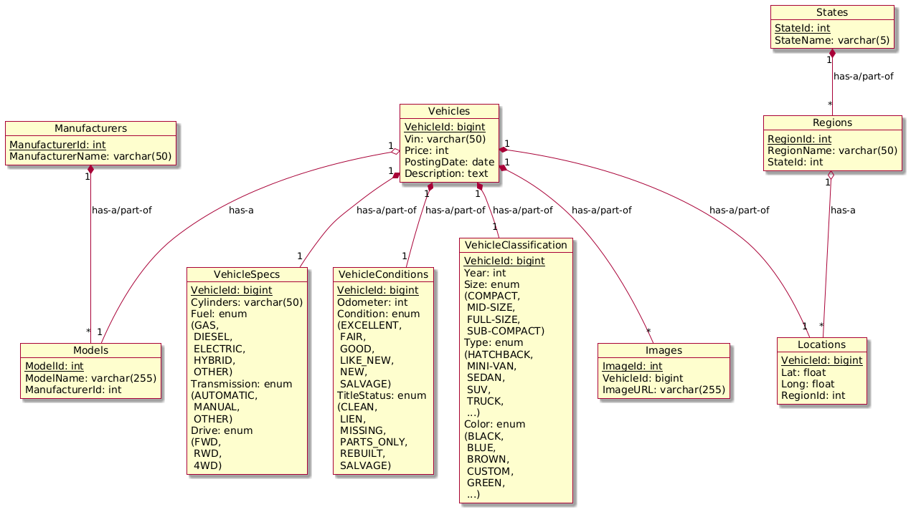

# PM3: Business Insights

## Project and Team

Project Name: **CarGenie**

Team Name: **HuskyAutoCoders** (Team 4)

Team Members:
- Yun Chen Chang
- Jinpeng Liu
- Luwei Fang
- Qiuying Zhuo
- Wen Xie
- Zhe Zhang
- Ziqi Liu

## Business Insights Questions

1. What are the most common vehicle colors listed for sale?  Understanding color popularity helps in analyzing customer preferences and market trends.
2. How are vehicles distributed across different conditions (e.g., Excellent, Good, Fair, Salvage)? This helps assess the quality of listings and market segmentation.
3. How many vehicles are listed for each fuel type? This helps analyze the adoption of different fuel types in the used car market.
4. How many vehicles were listed in a specific year and month? This helps analyze seasonal trends and listing activity over time.
5. Which vehicle types are most common in the used car market? This helps identify trends and customer demand for different vehicle categories.
6. Which manufacturers have the highest average vehicle listing prices? This helps identify premium brands and market trends in vehicle pricing.
7. Which states have the highest number of vehicle listings? Understanding regional demand helps optimize inventory distribution.
8. Which vehicle models are the most popular in a specific state (e.g., Washington)? This helps analyze local market trends and buyer preferences.
9. As a buyer in a specific state (e.g., Washington) looking for a certain model (e.g., Toyota RAV4), which listings offer the best value in terms of price relative to mileage? For now, we define high-value vehicles as those with a high price-to-mileage ratio, where lower mileage suggests better condition.
10. How does vehicle price vary based on vehicle age? This helps buyers compare pricing trends for older vs. newer vehicles.

## Select Queries for Business Insights

1. What are the most common vehicle colors listed for sale?  Understanding color popularity helps in analyzing customer preferences and market trends.

    ```sql
    -- Count the number of vehicles listed for sale, grouped by color
    SELECT 
        Color, COUNT(*) AS ColorCount
    FROM
        VehicleClassification
    WHERE
        Color IS NOT NULL
    GROUP BY Color
    ORDER BY ColorCount DESC;

    /*
    Color,ColorCount
    WHITE,22790
    BLACK,18927
    SILVER,13731
    BLUE,9283
    RED,8284
    GREY,7689
    CUSTOM,1992
    GREEN,1837
    BROWN,1668
    ORANGE,541
    YELLOW,541
    PURPLE,192
    */
    ```

2. How are vehicles distributed across different conditions (e.g., Excellent, Good, Fair, Salvage)? This helps assess the quality of listings and market segmentation.

    ```sql
    -- Count vehicles by condition and calculate their percentage of the total listings
    SELECT 
        VehicleConditions.VehicleCondition,
        COUNT(*) AS VehicleCount,
        ROUND(COUNT(*) * 100.0 / (SELECT 
                        COUNT(*)
                    FROM
                        VehicleConditions
                    WHERE
                        VehicleCondition IS NOT NULL),
                2) AS Percentage
    FROM
        VehicleConditions
    WHERE
        VehicleConditions.VehicleCondition IS NOT NULL
    GROUP BY VehicleConditions.VehicleCondition
    ORDER BY VehicleCount DESC;

    /*
    VehicleCondition,VehicleCount,Percentage
    EXCELLENT,32063,52.48
    GOOD,23921,39.15
    LIKE_NEW,3952,6.47
    FAIR,767,1.26
    NEW,331,0.54
    SALVAGE,60,0.10
    */
    ```

3. How many vehicles are listed for each fuel type? This helps analyze the adoption of different fuel types in the used car market.

    ```sql
    -- Count the number of vehicles listed for each fuel type
    SELECT 
        Fuel, COUNT(*) AS VehicleCount
    FROM
        Vehicles
            JOIN
        VehicleSpecs ON Vehicles.VehicleId = VehicleSpecs.VehicleId
    WHERE
        Fuel IS NOT NULL
    GROUP BY Fuel
    ORDER BY VehicleCount DESC;

    /*
    Fuel,VehicleCount
    GAS,100656
    OTHER,7867
    DIESEL,6001
    HYBRID,1571
    ELECTRIC,525
    */
    ```

4. How many vehicles were listed in a specific year and month? This helps analyze seasonal trends and listing activity over time.

    ```sql
    -- Count vehicle listings by a specific year and month
    SELECT 
        YEAR(PostingDate) AS PostYear,
        MONTH(PostingDate) AS PostMonth,
        COUNT(VehicleId) AS ListingCount
    FROM
        Vehicles
    WHERE
        YEAR(PostingDate) = 2021
            AND MONTH(PostingDate) = 4
    GROUP BY PostYear , PostMonth;

    /*
    PostYear,PostMonth,ListingCount
    2021,4,88723
    */
    ```

5. Which vehicle types are most common in the used car market? This helps identify trends and customer demand for different vehicle categories.

    ```sql
    -- Count the number of vehicles listed for each type
    SELECT 
        Type, COUNT(VehicleId) AS TypeCount
    FROM
        VehicleClassification
    WHERE
        Type IS NOT NULL
    GROUP BY Type
    ORDER BY TypeCount DESC;

    /*
    Type,TypeCount
    SEDAN,28746
    PICKUP,10477
    TRUCK,9318
    OTHER,6268
    HATCHBACK,4861
    COUPE,4544
    WAGON,3825
    VAN,2615
    CONVERTIBLE,1958
    MINI-VAN,1534
    BUS,106
    OFFROAD,77
    */
    ```

6. Which manufacturers have the highest average vehicle listing prices? This helps identify premium brands and market trends in vehicle pricing.

    ```sql
    -- Rank the top 10 manufacturers by average vehicle listing price
    SELECT 
        ManufacturerName,
        COUNT(*) AS VehicleCount,
        ROUND(AVG(Price)) AS AvgPrice
    FROM
        Vehicles
            JOIN
        Models ON Vehicles.ModelId = Models.ModelId
            JOIN
        Manufacturers ON Models.ManufacturerId = Manufacturers.ManufacturerId
    GROUP BY ManufacturerName
    ORDER BY AvgPrice DESC
    LIMIT 10;

    /*
    ManufacturerName,VehicleCount,AvgPrice
    ferrari,30,151520
    aston-martin,11,72652
    tesla,165,41878
    porsche,472,39817
    rover,645,29934
    ram,4536,29906
    chevrolet,13732,29513
    alfa-romeo,161,28915
    gmc,4636,25133
    mercedes-benz,3384,22447
    */
    ```

7. Which states have the highest number of vehicle listings? Understanding regional demand helps optimize inventory distribution.

    ```sql
    -- Count the number of vehicles listed in each state
    SELECT 
        StateName, COUNT(*) AS VehicleCount
    FROM
        Vehicles
            JOIN
        Locations ON Vehicles.VehicleId = Locations.VehicleId
            JOIN
        Regions ON Locations.RegionId = Regions.RegionId
            JOIN
        States ON Regions.StateId = States.StateId
    GROUP BY StateName
    ORDER BY VehicleCount DESC , StateName ASC
    LIMIT 10; -- for ease of display

    /*
    StateName,VehicleCount
    ca,16208
    fl,7129
    or,7006
    tx,6101
    wa,5432
    ny,4283
    co,4181
    oh,4108
    ia,3599
    nj,3566
    */    
    ```

8. Which vehicle models are the most popular in a specific state (e.g., Washington)? This helps analyze local market trends and buyer preferences.

    ```sql
    -- Retrieve the top 10 most available vehicle models in Washington State
    SELECT 
        ModelName, VehicleCnt
    FROM
        (SELECT 
            ModelId, COUNT(*) AS VehicleCnt
        FROM
            Vehicles
        JOIN Locations ON Locations.VehicleId = Vehicles.VehicleId
        JOIN Regions ON Locations.RegionId = Regions.RegionId
        JOIN States ON Regions.StateId = States.StateId
        WHERE
            ModelId IS NOT NULL AND StateName = 'wa'
        GROUP BY ModelId
        ORDER BY VehicleCnt DESC
        LIMIT 10) AS T
            JOIN
        Models ON Models.ModelId = T.ModelId;
        
    /*
    ModelName,VehicleCnt
    1500,102
    f-150,99
    "silverado 1500",57
    tacoma,46
    "wrangler unlimited",43
    outback,41
    2500,38
    wrangler,35
    "grand cherokee",34
    "wrangler unlimited sahara",32
    */
    ```

9. As a buyer in a specific state (e.g., Washington) looking for a certain model (e.g., Toyota RAV4), which listings offer the best value in terms of price relative to mileage? For now, we define high-value vehicles as those with a high price-to-mileage ratio, where lower mileage suggests better condition.

    ```sql
    -- Retrieve the top 10 RAV4s in Washington State with the highest price-to-mileage ratio  
    SELECT 
        FilteredVehicles.VehicleId,
        FilteredVehicles.ModelName,
        FilteredVehicles.Price,
        FilteredVehicles.Odometer AS Mileage,
        ROUND(FilteredVehicles.Price / NULLIF(FilteredVehicles.Odometer, 0),
                2) AS PriceToQualityRatio
    FROM
        (SELECT 
            Vehicles.VehicleId,
                Models.ModelName,
                Vehicles.Price,
                VehicleConditions.Odometer
        FROM
            Vehicles
        JOIN Models ON Vehicles.ModelId = Models.ModelId
        JOIN VehicleConditions ON Vehicles.VehicleId = VehicleConditions.VehicleId
        JOIN Locations ON Vehicles.VehicleId = Locations.VehicleId
        JOIN Regions ON Locations.RegionId = Regions.RegionId
        JOIN States ON Regions.StateId = States.StateId
        WHERE
            Models.ModelName LIKE '%rav4%'
                AND States.StateName = 'wa'
                AND Vehicles.Price IS NOT NULL
                AND VehicleConditions.Odometer IS NOT NULL) AS FilteredVehicles
    ORDER BY PriceToQualityRatio DESC
    LIMIT 10;

    /*
    VehicleId,ModelName,Price,Mileage,PriceToQualityRatio
    7316250174,"rav4 xle",27500,3920,7.02
    7310929118,rav4,33499,6477,5.17
    7306465180,"electric rav4 prime xse awd",49995,12500,4.00
    7317089710,"rav4 le awd 10k miles camera lane departure crash avoid 34 mpg",31995,10978,2.91
    7307760850,"rav4 hybrid",32999,14325,2.30
    7316877905,"a RAV4",26786,20053,1.34
    7306365638,rav4,27988,21361,1.31
    7304432284,"rav4 adventure awd gas",32489,25143,1.29
    7316223193,"rav4 le",25000,19498,1.28
    7305007657,"rav4 adventure awd gas",32436,26632,1.22
    */
    ```

10. How does vehicle price vary based on vehicle age? This helps buyers compare pricing trends for older vs. newer vehicles.  

    ```sql
    -- Calculate the average vehicle price grouped by vehicle age
    SELECT 
        2025 - VehicleClassification.Year AS VehicleAge,
        COUNT(Vehicles.VehicleId) AS VehicleCount,
        ROUND(AVG(Vehicles.Price), 0) AS AvgPrice
    FROM
        Vehicles
            JOIN
        VehicleClassification ON Vehicles.VehicleId = VehicleClassification.VehicleId
    WHERE
        Vehicles.Price IS NOT NULL
            AND VehicleClassification.Year IS NOT NULL
    GROUP BY VehicleAge
    ORDER BY VehicleAge ASC
    LIMIT 10; -- for ease of display

    /*
    VehicleAge,VehicleCount,AvgPrice
    3,28,16478
    4,746,33455
    5,4402,36716
    6,6215,32250
    7,9519,27604
    8,9162,25241
    9,7697,21911
    10,8320,35212
    11,8126,18369
    12,8360,15093
    */
    ```

## Quick Refernece

Latest UML (please refer to the PM2 submission for the CREATE queries): 

PM1: [Project Idea](https://docs.google.com/document/d/1gjREEfOMyCWx_K2DIqv8zDLRQRgHMfI71NrNcuou1_Y)

PM2: [Database Schema](https://github.com/saub0727/5200/blob/b8ed9806e45b2b9123fccd131ef54a496cc0243a/PM2.md)