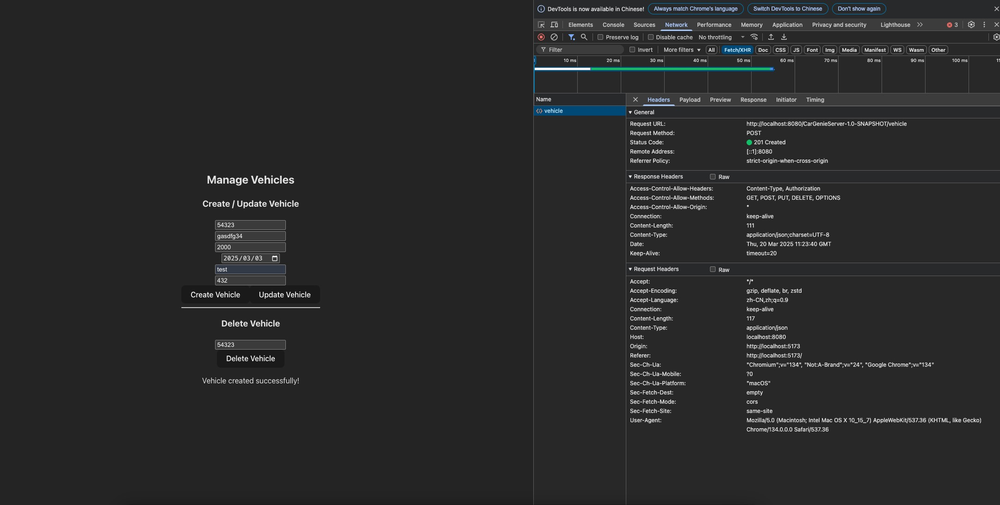

# PM4

## Project and Team

Project Name: **CarGenie**

Team Name: **HuskyAutoCoders** (Team 4)

Team Members:
- Yun Chen Chang
- Jinpeng Liu
- Luwei Fang
- Qiuying Zhuo
- Wen Xie
- Zhe Zhang
- Ziqi Liu

Dataset used: [Kaggle Used Cars Dataset](https://www.kaggle.com/datasets/austinreese/craigslist-carstrucks-data)

## Screenshots and CRUD functions
### 1.  **Home Page**
    - **Description**: The home page of CarGenie. There are three
   options for users to choose from: **Find Vehicle**, **Filter Vehicle**, and **Manage Vehicle**.

    
### 2. **Find Vehicle**
    - **Description**: Users can search for vehicles by entering the vehicle Vin.
    - **CRUD Functions**: Read the vehicle information by Vin.

### 3. **Filter Vehicle**
    - **Description**: Users can filter vehicles by selecting the vehicle condition, title status, fuel, transmission, drive and price range.
      - **Multi-criteria Filtering**: Users can apply multiple filters simultaneously to narrow down search results.
      - **Dynamic Query Optimization**: The system efficiently processes filter conditions to return results with minimal latency.
      - **Range-based Filtering**: Users can specify price ranges and other numerical attributes for more precise searches.
      - **Stateful Filtering**: Filters persist across user sessions, ensuring a seamless browsing experience.
      - **Sorting Integration**: Users can combine filters with sorting options (e.g., by price, mileage, or year). 
      - **_Smart Vehicle Recommendation (Advanced Feature)_**: If no vehicles match the selected filters, the system intelligently suggests similar vehicles based on relaxed filter criteria. Recommendations may include:
        Vehicles with slight variations in the selected attributes (e.g., slightly higher price or different transmission).
        Popular vehicles within the same category.
        Listings that match a subset of the applied filters.
    - **CRUD Functions**: 
      - Read: Retrieve vehicle listings based on the specified filter conditions using optimized database queries.
      - Recommend: When no exact matches are found, suggest alternative vehicles based on a predefined recommendation algorithm.
   

### 4. **Manage Vehicle**
    - **Description**: Users can manage vehicles by adding, updating, and deleting vehicle information.
    - **CRUD Functions**: Post, Read, Update, and Delete vehicle information.
   
   
- post vehicle:
 Users are able to post a vehicle by entering the vehicle information.

- update vehicle:
 Users are able to update the vehicle information by entering the vehicleId.

- delete vehicle:
 Users are able to delete the vehicle by entering the vehicleId.

